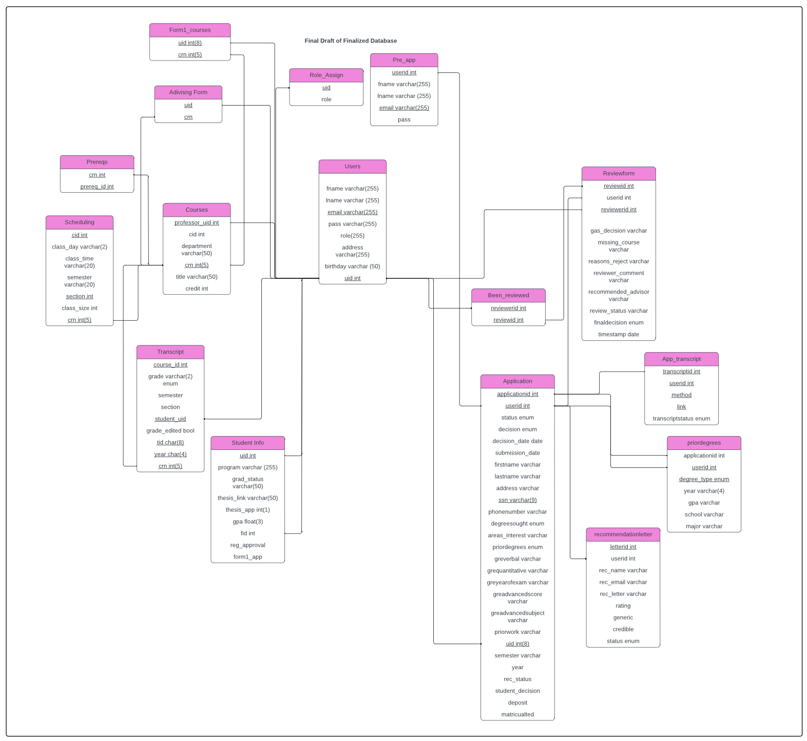
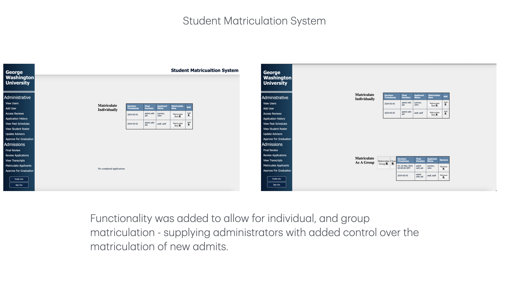
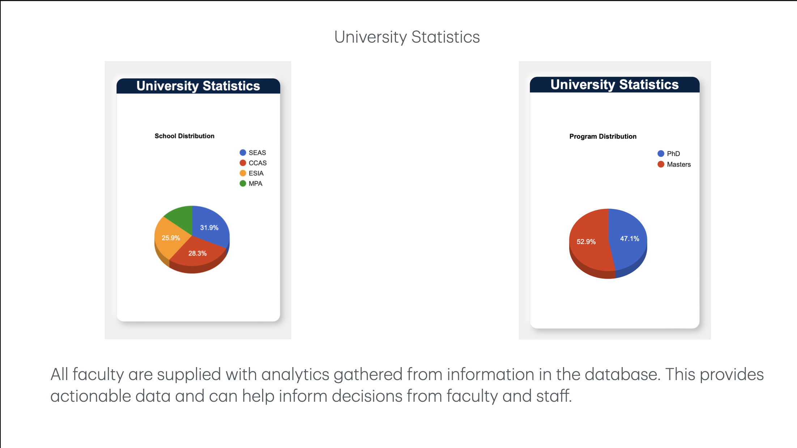
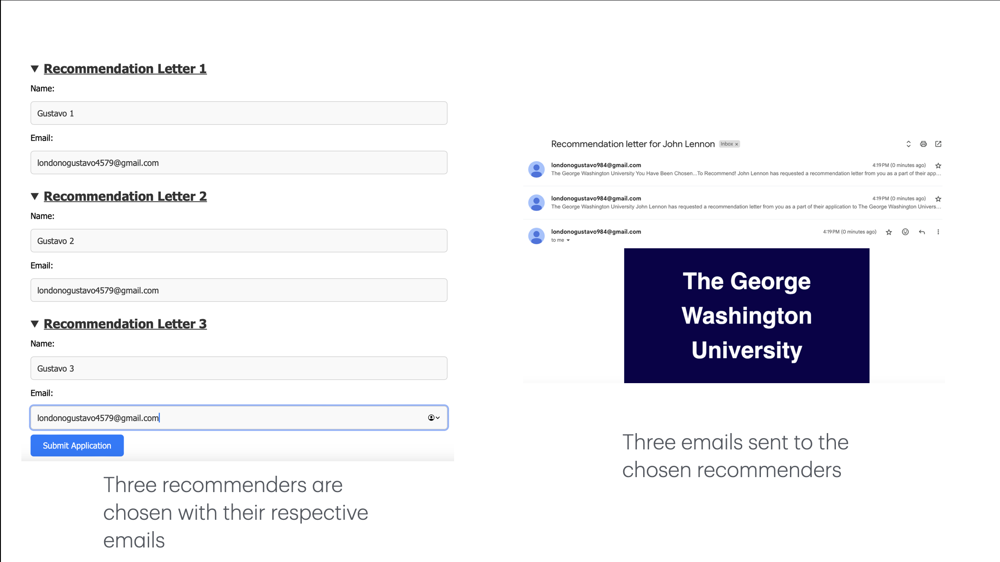
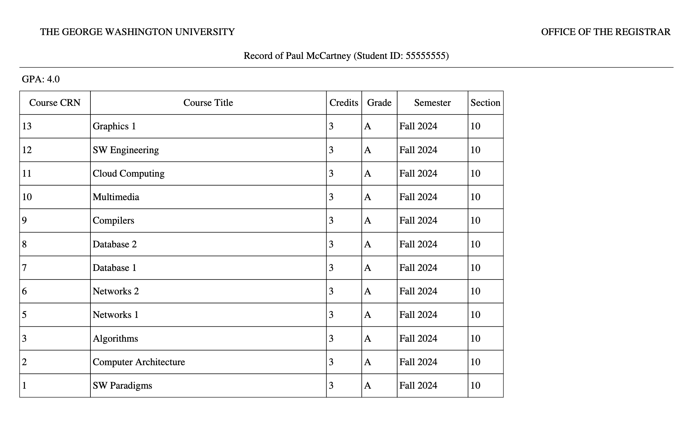
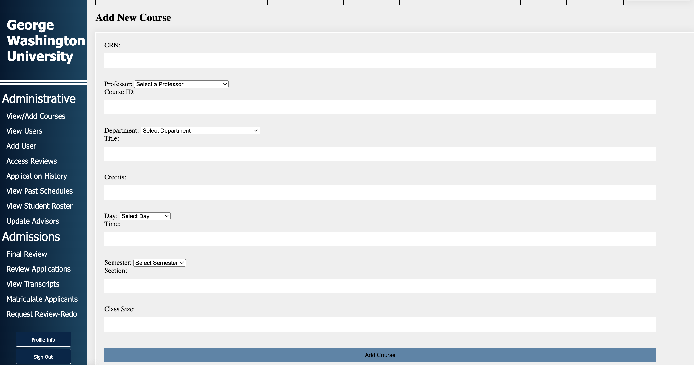
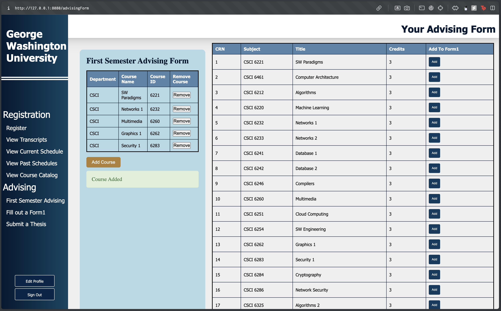

# Database Design, Justification and Normal Form Analysis

## Initial Consolidation:

The primary goal for the design of this database was _consolidation_. We started off by creating a visual representation of our SQL scripts in order to obtain a high level idea of where to get started (The stages of our design can be viewed in [Database Progression](Visuals/db_integration.pdf)). Upon first glance it was clear that there were multiple redundant attributes/tables present among the aggregation of our databases, and thus we were able to consolidate relatively quickly. ADS and REGS were adjusted according to the newly consolidated database and we were able to move onto functional integration. APPS, however, received the least amount of consolidation as the similarities were far and few compared to its counterparts.

## New Tables:

New tables were added in order to account for new functionality, or upgrades to previous functionality. A few examples:

**role_assign:** - In order to account for users to maintain multiple roles, a pseudo-RBAC (Rule Based Access Control) system was utilized. By creating the role_assign table, we were able to track all roles held by individual users. This table maintained a many-to-one relationship with the users table and a composite key in order to allow for multiple roles. We did however, maintain a "primary role" within the users table in order to act as a quick reference to the users' overall position. The "secondary roles
" held in role_assign were used for more specific access checks.

**pre_app** - During Phase 1 APPS utilized mutually exclusive unique identifiers userid and UID. The former was used to track users who have not yet submitted an application, but held an account within the database. UID was used when dealing with any other users past the submission of an application or university appointment (for faculty).

**advising_form** - Similar to the design of the Form1 table, advising_form held the courses a new student added, which is required before initial registration. This table utilized a composite key in order to maintain a many-to-one relationship with the users table.

**recommendationletter** - This new table allowed for a one-to-many relationship between users and the letters they were receiving from recommenders. This was accomplished with a letterid as a primary key.

## Normal Form Analysis - 2NF:

We believe that normal form 2NF has been achieved by the database detailed above. However, it should be noted that we also believe 3NF was just barely out of reach; The _SSN_ in the application table is _not_ specified as a primary key. The reasoning behind this decision is a simple design flaw in the overall workflow for the application UX. With the current workflow, users were able to save an application without entering an SSN. This however poses an issue for multiple applicants who wish to save without entering in an SSN as it would leave entries with "identical" SSNs. Given more time, we would have made it so that the SSN is required to be input before the save feature was utilized in order to prevent this issue from occurring. Thus retaining the SSN as a portion of the composite key.

# Visual Overview

## Student Homepage -- Photo

See the photo (link) to learn a little bit about the student homepage and the ADS functions that were on it.

# Design Justification

## APPS

Little to no functionality from the Phase I APPS needed to be changed _for integration_, and for this reason high level APPS integration was trivial. However, additional functionality like the following made it slightly challenging (_most to least challenging_):

- Support for multiple recommendation letters
- Support for a matriculation process
- Support for transcript submission
- Support for an applicant to accept/reject acceptance offers
- Support for deposit submission

Speaking to the integration, we began with creating the landing page for the overall project. This allowed for us to connect the three projects to a common point and create a user experience that is both fluid and intuitive. We also took the excellent template which Hashem's group had created for their dashboard and adjusted it to fit the functionality we needed to provide for Phase 2. With regards to the APPS integration, we created a matriculation process which took applicants that accepted their offers to the university and transferred their data to the "university" section of the database. Any data pertaining to the student prior to their acceptance which was deemed important by my partners was brought over during matriculation.

For the creation of the new features required by the specifications we began with reviewing and designing potential changes to the database that could accomplish such functionality. For instance, Phase I APPS held the recommendation letter in the same table as the application which in hindsight is not scalable. For this reason, we created a new table that allowed for a many-to-one relationship, and inevitably allowed for up to 3 letters per applicant. Support for an applicant to accept/reject offers, submit transcripts, and make deposits was trivial and only required a few attribute additions and checks.
 

## ADS

From the ADS perspective, combining the 3 components together wasn't too bad, as most of, if not all of ADS seemed to be integrated in the form of sidebar options for the layout that the group decided on. This includes the form1, thesis, advising form, along with the faculty side of approving these forms and files. Additionally, from the graduation secretary side, changing faculty advisors and approving for graduation were both also implemented as optional links on the side bar, the only changes needed being the cursor.executes and some other sections of code. I'd say the most interesting and work heavy part of my integration of ADS into the other two components was taking my long routes/backend checks and turning them into functions (located in `functions.py`) to make it easier to read through/debug `main.py`. The main load of the work for ADS was not the functions however, it was the CSS, as our group's goal was to not only get a fully functional page with the requirements that were needed, but also have a page that looked good and was easy to navigate. Our APPS was VERY CSS heavy, so we were required to "catch up" with it! Another part of REGS that was used with ADS was the course catalog. When adding courses to your form1 or advising form, the course catalog appeared on the right side with the courses and an add button next to each course. This made it easier to browse your options for courses and was a good way to combine the features of the two parts. 

Finally, we set ourselves the goal of creating a way for a students advisor to send a revised form1 or advising for BACK to the student that would be "better" for them or "fit" their degree requirements more, however unfortunately, this project had to be scrapped due to time constraints and the project deadline. In the future, this is DEFINITELY something I'd be interested in implementing.
 

## REGS

In the registration part, the main change during integration involved enhancing error checking when registering for courses. Our teammate Gustavo, responsible for the APPS component, organized his code by separating functions into a designated file called `functions.py`, allowing `main.py` to focus solely on core functionality. Inspired by this structure, we migrated all error-checking functions into `functions.py`, simplifying calls in `main.py`. Additionally, we introduced new sections for each course, which meant populating the database with additional sections in the scheduling table as well as necessitating a new error check to verify whether students registered for the same course across different sections. The Navbar implemented in our integrated project proved invaluable for centralizing route management, enabling straightforward inclusion of faculty, grad sec, registrar, and admin sections. Lastly, in collaboration with ADS (Thomas), we implemented a feature where a boolean attribute in our database, `regapproval`, changes to true when an advising form is approved, lifting any registration holds and permitting user registration.

 

# Special Features

## Remastered Matriculation Process

Our matriculation process differs from the base specifications as it satisfies the ability to choose either group matriculation or independent matriculation which allows for greater control over the process. A combination of session variables and python functionality allowed for this to work.

 

## University Analytics

University analytics using data supplied from the database provides faculty and staff with actionable data. A combination of Javascript, HTML, and Python allowed for this to work. (Guide attribution: https://developers.google.com/chart/interactive/docs)

 

## Recommendation Letters

The addition of recommendation letters via email brought a more professional and realistic look to the project. A combination of Python libraries, and flask url parameters allowed for this to work. (Guide attribution: https://www.youtube.com/watch?v=zxFXnLEmnb4 and https://www.geeksforgeeks.org/how-to-send-beautiful-emails-in-python/)

 

## Downloadable Transcript PDF

- **Download Transcript Button**: Using the Python library FPDF, we created a function that converts SQL query results and HTML content from the transcript page into a formatted PDF transcript. While the layout is largely hardcoded, it effectively handles any transcript from any student. This was done using these resources: https://github.com/reingart/pyfpdf  and https://www.youtube.com/watch?v=LwdiCtBuzng

 

## Registrar Role

- **Registrar Role**: Implemented functionalities allowing the registrar to delete a course from the schedule (while retaining it in the course catalog), add new courses to the schedule with checks for CRN duplication, and assign grades to all students.

 

## Advising Form

- **Advising Form**: We were put in charge of creating the advising form, as requested by the client. A student would have to submit and have their form approved before they could register for classes. This was linked to REGS through the reg_approval attribute in the studInfo table which would deny registration if it was 0 (not approved) and allow registration if it was 1 (approved).

 